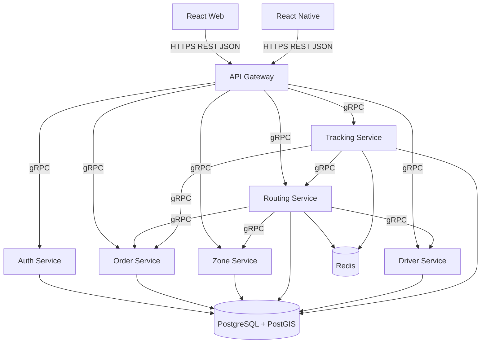
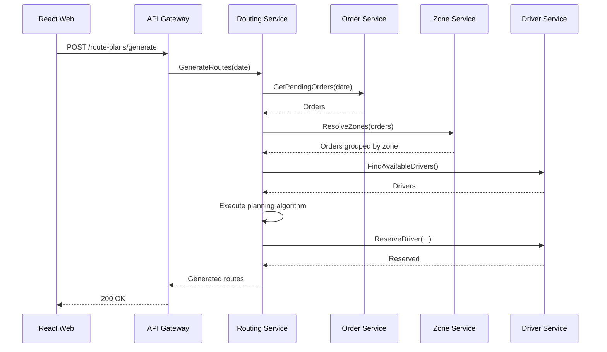
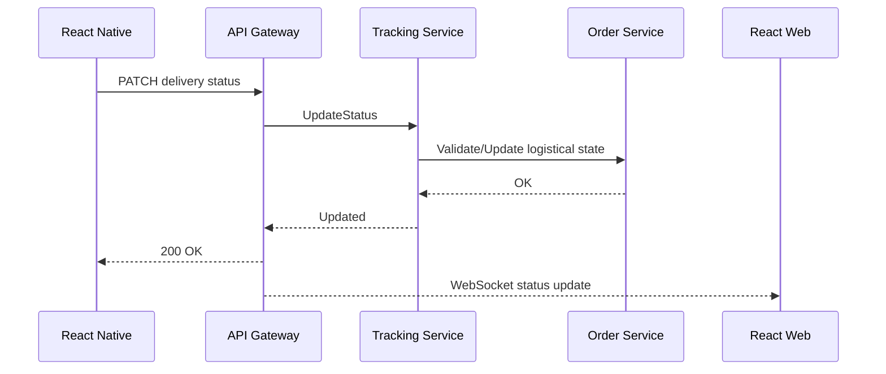
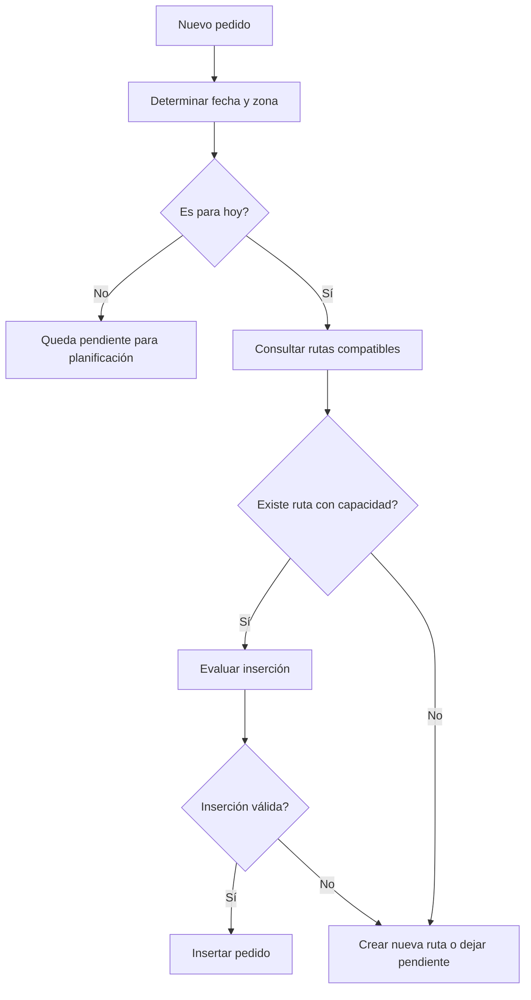

# Base técnica y arquitectónica del proyecto
## Sistema de Gestión de Entregas y Rutas — Logística de Última Milla

**Estado:** Base técnica inicial del proyecto  
**Objetivo:** Definir una arquitectura común para iniciar el desarrollo del backend, aplicación web, aplicación móvil y entorno de pruebas.  
**Arquitectura backend:** Microservicios con Go + Echo.  
**Comunicación externa:** REST/JSON sobre HTTPS.  
**Comunicación interna:** gRPC síncrono entre microservicios.  
**Frontend web:** React + TypeScript.  
**Aplicación móvil:** React Native + TypeScript, orientada principalmente a repartidores.  
**Persistencia:** Una única instancia PostgreSQL con separación lógica de datos por servicio.  
**Geodatos:** PostGIS.  
**Datos efímeros / caché:** Redis.  
**Mensajería asíncrona:** No se utilizará Kafka ni otro broker en esta primera versión.

---

# 1. Contexto del proyecto

El sistema está orientado a negocios que realizan entregas físicas a domicilio, como restaurantes, floristerías, tiendas, farmacias, negocios de regalos u otros comercios con logística de última milla.

El problema principal no consiste únicamente en registrar pedidos. El sistema debe decidir:

- qué pedidos deben entregarse en una fecha determinada;
- qué pedidos pertenecen a una misma zona;
- cuáles pueden agruparse dentro de una misma ruta;
- qué repartidor debe atender cada ruta;
- en qué orden deben visitarse las entregas;
- qué hacer cuando ingresa un pedido de último momento;
- cómo respetar la capacidad máxima permitida por ruta;
- cómo evitar asignaciones inconsistentes cuando existen operaciones concurrentes;
- cómo mantener sincronizado el estado de las entregas entre la aplicación móvil y la aplicación web.

Los pedidos pueden registrarse días o semanas antes de la fecha de entrega, pero también pueden aparecer pedidos adicionales durante el mismo día de operación.

El sistema debe soportar escenarios normales y escenarios de alta demanda con cientos o miles de pedidos.

---

# 2. Objetivo general del sistema

El sistema deberá permitir:

1. Registrar pedidos con fecha, hora aproximada y dirección de entrega.
2. Clasificar y agrupar pedidos por fecha y zona geográfica.
3. Generar rutas de entrega respetando la capacidad máxima configurada.
4. Asignar rutas a repartidores disponibles.
5. Insertar pedidos de último momento en rutas existentes cuando sea posible.
6. Crear una nueva ruta cuando un pedido no pueda incorporarse de forma válida en las rutas actuales.
7. Mantener el estado de cada pedido durante todo el proceso de entrega.
8. Reflejar en la aplicación web los cambios realizados desde la aplicación móvil.
9. Permitir ajustes manuales por parte del personal autorizado.
10. Evitar asignaciones dobles o inconsistentes bajo concurrencia.

---

# 3. Alcance funcional mínimo

## 3.1 Gestión de pedidos

Debe permitir:

- registrar un pedido;
- registrar la dirección;
- registrar fecha de entrega;
- registrar una ventana u hora aproximada de entrega;
- consultar pedidos;
- actualizar información permitida antes del despacho;
- cancelar pedidos cuando las reglas de negocio lo permitan;
- conocer el estado logístico del pedido.

Estados iniciales sugeridos:

```text
PENDING
ROUTE_ASSIGNED
PICKED_UP
IN_TRANSIT
DELIVERED
CANCELLED
```

---

## 3.2 Gestión de zonas

Debe permitir:

- crear zonas de reparto;
- modificar zonas;
- definir límites geográficos;
- determinar a qué zona pertenece una dirección;
- agrupar pedidos de una misma fecha por proximidad o zona.

Las zonas podrán representarse mediante polígonos geográficos utilizando PostGIS.

---

## 3.3 Armado de rutas

Debe permitir:

- obtener pedidos pendientes para una fecha;
- agruparlos por zona;
- respetar la capacidad máxima por ruta;
- ordenar las paradas;
- generar rutas;
- reasignar rutas cuando corresponda;
- realizar ajustes manuales autorizados;
- insertar pedidos de último momento cuando exista capacidad y la inserción sea válida.

Ejemplo:

```text
Zona Norte
├── Ruta N-001
│   ├── Pedido 101
│   ├── Pedido 108
│   ├── Pedido 112
│   └── Pedido 115
│
└── Ruta N-002
    ├── Pedido 119
    └── Pedido 123
```

La capacidad máxima será configurable.

Ejemplo:

```text
MAX_ORDERS_PER_ROUTE=4
```

---

## 3.4 Gestión de repartidores

Debe permitir:

- registrar repartidores;
- activar o desactivar repartidores;
- conocer disponibilidad;
- consultar rutas asignadas;
- asignar rutas;
- evitar asignaciones incompatibles;
- registrar el estado operativo.

Estados sugeridos:

```text
AVAILABLE
ASSIGNED
ON_ROUTE
OFFLINE
```

---

## 3.5 Seguimiento de entregas

Debe permitir:

- marcar pedido como recogido;
- marcar pedido como en camino;
- marcar pedido como entregado;
- registrar fecha/hora de cambios;
- mostrar el avance en la aplicación web;
- permitir que el repartidor consulte el orden de sus paradas.

Opcionalmente se podrá registrar la última ubicación conocida del repartidor.

---

# 4. Aplicaciones cliente

## 4.1 Aplicación web

Tecnologías:

```text
React
TypeScript
```

Usuarios principales:

```text
personal operativo
administradores
despachadores
```

Funciones principales:

- registrar pedidos;
- consultar pedidos;
- administrar zonas;
- lanzar el armado de rutas;
- visualizar rutas generadas;
- realizar ajustes manuales;
- consultar repartidores;
- visualizar estado de entregas;
- supervisar pedidos de último momento.

---

## 4.2 Aplicación móvil

Tecnologías:

```text
React Native
TypeScript
```

Usuario principal:

```text
repartidor
```

Funciones principales:

- autenticarse;
- consultar ruta asignada;
- visualizar orden de paradas;
- visualizar datos necesarios de cada entrega;
- marcar pedido como recogido;
- marcar pedido como en camino;
- marcar pedido como entregado;
- consultar progreso de la ruta;
- enviar ubicación cuando dicha funcionalidad se habilite.

---

# 5. Stack tecnológico

| Responsabilidad | Tecnología |
|---|---|
| Backend | Go |
| Framework backend | Echo |
| API pública | REST |
| Formato API | JSON |
| Comunicación interna | gRPC síncrono |
| Frontend web | React |
| Frontend móvil | React Native |
| Lenguaje frontend | TypeScript |
| Base de datos | PostgreSQL |
| Geodatos | PostGIS |
| Datos efímeros / caché | Redis |
| Autenticación | JWT |
| Documentación de API | OpenAPI / Swagger |
| Contenedores | Docker |
| Pruebas backend | testing + Testify |
| Pruebas React | Vitest + React Testing Library |
| Pruebas React Native | Jest + React Native Testing Library |
| E2E web | Playwright |
| Rendimiento / carga / estrés | k6 |
| Seguridad DAST | OWASP ZAP |
| Análisis Go | go vet + golangci-lint |
| Análisis frontend | TypeScript + ESLint |
| Gobernanza de calidad | SonarQube |

---

# 6. Arquitectura general



---

# 7. Principios arquitectónicos

## 7.1 Microservicios con responsabilidad clara

Cada microservicio será responsable de una capacidad del negocio.

Un servicio:

- no debe modificar datos pertenecientes a otro servicio;
- no debe conocer las tablas internas de otro servicio;
- debe comunicarse mediante contratos;
- debe ser desplegable de forma independiente;
- debe mantener pruebas propias;
- debe poseer sus migraciones.

---

## 7.2 Una sola instancia PostgreSQL

El sistema utilizará inicialmente una sola instancia física de PostgreSQL.

La separación será lógica:

```text
PostgreSQL
├── auth
├── orders
├── zones
├── routing
├── drivers
└── tracking
```

Esto reduce la complejidad operativa sin eliminar la separación de responsabilidades.

---

## 7.3 Propiedad de datos

Ejemplo:

```text
Order Service
    |
    +--> orders.*

Routing Service
    |
    +--> routing.*

Driver Service
    |
    +--> drivers.*
```

No está permitido:

```sql
-- INCORRECTO
SELECT *
FROM drivers.driver
```

desde `Order Service`.

Si `Order Service` necesita información de un repartidor deberá utilizar el contrato de `Driver Service`.

---

# 8. Microservicios

## 8.1 API Gateway

Responsabilidades:

- punto único de entrada;
- exponer `/api/v1`;
- autenticación inicial;
- propagación de identidad;
- CORS;
- rate limiting;
- correlación de solicitudes;
- transformación de errores;
- REST/JSON hacia web y móvil;
- llamadas gRPC hacia servicios internos.

El Gateway no contendrá reglas del negocio.

---

## 8.2 Auth Service

Responsabilidades:

- usuarios;
- autenticación;
- emisión de JWT;
- validación de credenciales;
- roles;
- permisos;
- revocación de sesión cuando se implemente.

Roles iniciales:

```text
ADMIN
OPERATOR
DRIVER
```

Un rol `CUSTOMER` podrá incorporarse si posteriormente se habilita acceso directo para clientes.

---

## 8.3 Order Service

Responsabilidades:

- pedidos;
- fecha de registro;
- fecha de entrega;
- hora o ventana de entrega;
- dirección;
- coordenadas;
- prioridad;
- estado logístico;
- cancelaciones;
- historial básico;
- validaciones del pedido.

Una distinción importante será:

```text
created_at
```

no es equivalente a:

```text
delivery_date
```

El modelo deberá mantener ambos conceptos de forma independiente.

---

## 8.4 Zone Service

Responsabilidades:

- zonas geográficas;
- polígonos;
- búsqueda de zona;
- clasificación de coordenadas;
- reglas de cobertura.

Tecnología geográfica:

```text
PostgreSQL + PostGIS
```

Ejemplos de operaciones:

```text
ST_Contains
ST_Within
ST_DWithin
ST_Distance
```

Se utilizarán índices espaciales GiST cuando corresponda.

---

## 8.5 Routing Service

Es el núcleo logístico del sistema.

Responsabilidades:

- seleccionar pedidos pendientes por fecha;
- agrupar pedidos;
- aplicar el algoritmo de planificación;
- respetar capacidad;
- generar rutas;
- ordenar paradas;
- insertar pedidos tardíos;
- asignar una ruta a un repartidor disponible;
- impedir asignaciones conflictivas;
- recalcular cuando una operación autorizada lo requiera.

Entidades principales:

```text
Route
RouteStop
RouteAssignment
PlanningRun
```

Estados sugeridos de ruta:

```text
DRAFT
ASSIGNED
IN_PROGRESS
COMPLETED
CANCELLED
```

---

## 8.6 Driver Service

Responsabilidades:

- repartidores;
- disponibilidad;
- información operacional;
- estado;
- validación de disponibilidad;
- rutas activas.

---

## 8.7 Tracking Service

Responsabilidades:

- cambios de estado durante la ejecución;
- fecha/hora de cada transición;
- última posición conocida si se utiliza tracking;
- información necesaria para seguimiento;
- sincronización operacional con la aplicación web.

Redis podrá almacenar información efímera como:

```text
última ubicación conocida
estado temporal de conexión
datos de consulta frecuente
```

La información persistente seguirá almacenándose en PostgreSQL.

---

# 9. Comunicación entre microservicios

## 9.1 REST hacia clientes

React y React Native utilizarán:

```text
HTTPS
REST
JSON
```

Ejemplo:

```http
GET /api/v1/routes/my-current
Authorization: Bearer <token>
```

---

## 9.2 gRPC síncrono internamente

Los microservicios utilizarán **gRPC síncrono** cuando necesiten solicitar una operación y esperar una respuesta.

```text
Routing Service
      |
      | GetPendingOrders(date)
      v
Order Service
      |
      | response
      v
Routing Service
```

Ejemplos:

```text
Routing Service -> Order Service
Routing Service -> Zone Service
Routing Service -> Driver Service
Tracking Service -> Order Service
Tracking Service -> Routing Service
```

Los contratos se definirán mediante `.proto`.

Ejemplo:

```proto
syntax = "proto3";

package driver.v1;

service DriverService {
  rpc FindAvailableDrivers(FindAvailableDriversRequest)
      returns (FindAvailableDriversResponse);

  rpc ReserveDriver(ReserveDriverRequest)
      returns (ReserveDriverResponse);
}
```

Reglas:

- todas las llamadas deben utilizar timeout/deadline;
- no se utilizarán llamadas gRPC desde React o React Native;
- los errores deben mapearse a errores de dominio/aplicación;
- las operaciones que puedan reintentarse deberán ser idempotentes;
- se evitarán cadenas innecesariamente largas de llamadas;
- los archivos `.proto` se versionarán.

---

# 10. Sin Kafka en la primera versión

La arquitectura base no utilizará:

```text
Kafka
RabbitMQ
NATS
Redis Streams
```

Los flujos entre servicios se resolverán inicialmente mediante gRPC síncrono.

Esta decisión disminuye:

- infraestructura;
- complejidad operacional;
- manejo de offsets;
- gestión de consumidores;
- reintentos asíncronos;
- duplicados de mensajes;
- consistencia eventual.

Si en una versión futura se requiere desacoplamiento asíncrono, se podrá incorporar un broker sin modificar la propiedad de datos de los servicios.

---

# 11. Sincronización web-móvil

Cuando un repartidor cambie el estado de una entrega:

```text
React Native
    |
    | REST
    v
API Gateway
    |
    | gRPC
    v
Tracking Service
    |
    +--> PostgreSQL
    |
    +--> actualización operacional
```

El cambio debe quedar disponible inmediatamente para la aplicación web.

La primera implementación podrá utilizar:

```text
WebSocket
```

para notificar actualizaciones desde el Gateway hacia la aplicación web.

Flujo:

```text
Mobile
  |
  | PUT delivery status
  v
Gateway
  |
  v
Tracking Service
  |
  | OK
  v
Gateway
  |
  | WebSocket
  v
React Web
```

Si el WebSocket no estuviera disponible temporalmente, la aplicación web deberá poder recuperar el estado mediante REST.

---

# 12. Generación de rutas

La generación de rutas podrá dispararse de dos formas:

```text
1. Acción manual
2. Ejecución programada
```

Ambos mecanismos deben ejecutar el mismo caso de uso:

```text
GenerateRoutesForDate
```

Ejemplo:

```text
POST /api/v1/route-plans/generate
```

Request:

```json
{
  "deliveryDate": "2026-12-24"
}
```

---

# 13. Algoritmo de planificación

El algoritmo concreto deberá poder sustituirse sin modificar el resto del `Routing Service`.

Contrato conceptual:

```go
type RoutePlanner interface {
    Plan(
        ctx context.Context,
        input PlanningInput,
    ) ([]RoutePlan, error)
}
```

Opciones a evaluar:

- vecino más cercano;
- puntaje ponderado;
- algoritmo húngaro;
- heurísticas de inserción;
- Capacitated Vehicle Routing Problem;
- Vehicle Routing Problem with Time Windows;
- clusterización geográfica previa.

La arquitectura debe permitir comparar algoritmos sin acoplar los handlers ni la persistencia a una implementación concreta.

---

## 13.1 Estrategia inicial de referencia

Para una primera implementación funcional se podrá utilizar:

```text
fecha de entrega
        |
        v
agrupación por zona
        |
        v
pedidos pendientes
        |
        v
agrupación por capacidad
        |
        v
heurística de ordenamiento/inserción
        |
        v
rutas
```

La elección final del algoritmo deberá quedar documentada en el informe del proyecto.

---

# 14. Pedidos de último momento

Cuando llegue un pedido para el mismo día:

```text
Nuevo pedido
    |
    v
Identificar zona
    |
    v
Buscar rutas compatibles
    |
    +--> existe capacidad
    |       |
    |       v
    |   evaluar inserción
    |
    +--> no existe capacidad
            |
            v
       crear nueva ruta
       o dejar pendiente
       según regla configurada
```

Una inserción será válida solamente si:

- la ruta no supera su capacidad;
- corresponde a la fecha de entrega;
- corresponde a una zona compatible;
- no viola reglas temporales;
- el repartidor puede completar la ruta;
- no existe un conflicto de asignación.

---

# 15. Capacidad

La capacidad de ruta será configurable.

Ejemplo:

```env
MAX_ORDERS_PER_ROUTE=4
```

El sistema no debe asumir el valor `4` directamente en código.

---

# 16. Concurrencia y consistencia

Una de las reglas críticas es impedir asignaciones duplicadas bajo alta concurrencia.

Invariantes:

```text
un pedido no puede pertenecer a dos rutas activas
una ruta no puede superar su capacidad
una ruta activa tiene como máximo un repartidor asignado
un repartidor no puede tener dos asignaciones incompatibles en el mismo intervalo
```

---

## 16.1 Transacciones

Las operaciones de asignación se ejecutarán dentro de transacciones PostgreSQL.

Cuando corresponda podrán utilizarse:

```sql
SELECT ... FOR UPDATE;
```

para bloquear temporalmente recursos involucrados en una asignación.

---

## 16.2 Restricciones de base de datos

Las reglas críticas deben estar reforzadas mediante:

- claves únicas;
- foreign keys;
- check constraints;
- índices;
- transacciones;
- validaciones de dominio.

No se debe confiar únicamente en validaciones del frontend.

---

## 16.3 Control optimista

Las entidades susceptibles a modificaciones concurrentes podrán utilizar:

```text
version
```

o:

```text
updated_at
```

para detectar escrituras sobre información obsoleta.

---

## 16.4 Idempotencia

Operaciones importantes:

```text
crear pedido
generar rutas
asignar ruta
actualizar estado de entrega
```

deben diseñarse para tolerar reintentos.

Cuando corresponda:

```http
Idempotency-Key: <uuid>
```

---

# 17. Modelo geográfico

La dirección deberá almacenar, cuando sea posible:

```text
address_text
latitude
longitude
zone_id
```

PostGIS permitirá utilizar:

```text
Point
Polygon
Geography
Geometry
```

Los cálculos geográficos deberán realizarse en el backend, no en el cliente.

---

# 18. Persistencia

## 18.1 Esquemas

```text
auth
orders
zones
routing
drivers
tracking
```

---

## 18.2 Usuarios PostgreSQL

Idealmente:

```text
auth_service_user
order_service_user
zone_service_user
routing_service_user
driver_service_user
tracking_service_user
```

Cada usuario tendrá permisos únicamente sobre su esquema.

---

## 18.3 Migraciones

Cada servicio administra sus propias migraciones.

```text
services/
└── routing-service/
    └── migrations/
        ├── 000001_create_routes.up.sql
        ├── 000001_create_routes.down.sql
        ├── 000002_create_route_stops.up.sql
        └── 000002_create_route_stops.down.sql
```

---

# 19. Backend — arquitectura interna

Cada microservicio utilizará una arquitectura hexagonal / Clean Architecture ligera.

```text
service/
├── cmd/
├── internal/
│   ├── domain/
│   ├── application/
│   ├── adapters/
│   └── infrastructure/
├── migrations/
├── tests/
└── Dockerfile
```

Dependencias:

```text
Infrastructure
     |
     v
Adapters
     |
     v
Application
     |
     v
Domain
```

La capa de dominio no debe depender de Echo, PostgreSQL ni gRPC.

---

# 20. Ejemplo: Routing Service

```text
routing-service/
├── cmd/
│   └── api/
│       └── main.go
│
├── internal/
│   ├── domain/
│   │   ├── route.go
│   │   ├── route_stop.go
│   │   ├── planning.go
│   │   └── errors.go
│   │
│   ├── application/
│   │   ├── generate_routes.go
│   │   ├── insert_late_order.go
│   │   ├── assign_driver.go
│   │   └── ports/
│   │
│   ├── adapters/
│   │   ├── http/
│   │   ├── grpc/
│   │   └── persistence/
│   │
│   └── infrastructure/
│       ├── postgres/
│       ├── redis/
│       └── config/
│
├── migrations/
├── tests/
├── go.mod
└── Dockerfile
```

---

# 21. React Native

La aplicación móvil utilizará:

> **Vertical Slice Architecture + Feature-Based Organization + principios pragmáticos de Clean Architecture.**

No se aplicará Clean Architecture pura si introduce abstracciones sin valor real.

---

## 21.1 Estructura

```text
apps/
└── mobile/
    └── src/
        ├── app/
        │   ├── navigation/
        │   ├── providers/
        │   ├── config/
        │   └── App.tsx
        │
        ├── features/
        │   ├── auth/
        │   ├── route/
        │   ├── stops/
        │   ├── delivery/
        │   └── profile/
        │
        ├── shared/
        │   ├── api/
        │   ├── ui/
        │   ├── storage/
        │   ├── errors/
        │   ├── hooks/
        │   ├── types/
        │   └── utils/
        │
        └── assets/
```

---

## 21.2 Ejemplo de slice

```text
features/
└── delivery/
    ├── presentation/
    │   ├── screens/
    │   ├── components/
    │   └── hooks/
    │
    ├── application/
    │   └── useCases/
    │
    ├── domain/
    │   ├── entities/
    │   ├── repositories/
    │   └── errors/
    │
    ├── infrastructure/
    │   ├── api/
    │   ├── repositories/
    │   └── mappers/
    │
    └── tests/
```

Las capas se agregarán solamente cuando la complejidad del slice lo justifique.

---

# 22. Estado en React Native

## Datos del servidor

```text
TanStack Query
```

Ejemplos:

```text
ruta actual
paradas
estado de entregas
perfil del repartidor
```

## Estado local

```text
Zustand
```

Ejemplos:

```text
preferencias
estado temporal de UI
filtros
información local no remota
```

No se duplicará en Zustand información ya administrada por TanStack Query.

---

# 23. React Web

La aplicación web utilizará:

```text
React
TypeScript
```

Organización:

```text
apps/
└── web/
    └── src/
        ├── app/
        ├── features/
        │   ├── auth/
        │   ├── orders/
        │   ├── zones/
        │   ├── routing/
        │   ├── drivers/
        │   └── tracking/
        ├── shared/
        └── assets/
```

---

# 24. Contratos REST

Las APIs públicas se documentarán mediante OpenAPI.

Ejemplos:

```text
POST /api/v1/orders
GET  /api/v1/orders
GET  /api/v1/orders/{id}

POST /api/v1/route-plans/generate
GET  /api/v1/routes
GET  /api/v1/routes/{id}

GET  /api/v1/drivers
GET  /api/v1/drivers/me/route

PATCH /api/v1/deliveries/{id}/status
```

---

# 25. Contratos gRPC

Los contratos internos estarán en:

```text
contracts/
└── proto/
    ├── auth/
    ├── orders/
    ├── zones/
    ├── routing/
    ├── drivers/
    └── tracking/
```

Versionado:

```text
orders.v1
routing.v1
drivers.v1
```

---

# 26. Seguridad

## 26.1 JWT

Los clientes utilizarán JWT mediante:

```http
Authorization: Bearer <token>
```

El token deberá contener información mínima.

---

## 26.2 Autorización

Debe validarse:

```text
identidad
+
rol
+
pertenencia/autorización sobre el recurso
```

Un repartidor únicamente podrá actualizar entregas correspondientes a su ruta activa.

---

## 26.3 Validación de entradas

Todas las entradas deberán validarse en backend.

Ejemplos:

- coordenadas válidas;
- fechas válidas;
- ventanas horarias válidas;
- transición válida de estados;
- identificadores válidos;
- capacidad válida;
- dirección requerida.

---

## 26.4 SQL Injection

Se utilizarán consultas parametrizadas.

---

## 26.5 HTTP

Configurar:

```text
HTTPS
CORS
rate limiting
HSTS
X-Content-Type-Options
timeouts
request size limits
```

---

# 27. Redis

Usos permitidos:

- caché;
- rate limiting;
- datos efímeros;
- última ubicación;
- locks breves cuando sean técnicamente necesarios;
- información temporal.

Redis no será fuente primaria de verdad para:

```text
pedidos
rutas
asignaciones
estados persistentes
```

---

# 28. Flujo principal de planificación



---

# 29. Flujo de entrega



---

# 30. Flujo de pedido de último momento



---

# 31. Pruebas

El plan debe cubrir:

```text
análisis estático
pruebas unitarias
pruebas de integración
pruebas del sistema
pruebas de volumen
pruebas de carga
pruebas de estrés
```

---

## 31.1 Backend

Herramientas:

```text
testing
httptest
Testify
```

Casos críticos:

- creación de pedidos;
- agrupación por fecha;
- agrupación por zona;
- capacidad;
- generación de rutas;
- asignación concurrente;
- inserción de pedidos tardíos;
- transiciones de estado;
- autorización;
- idempotencia.

---

## 31.2 React

Herramientas:

```text
Vitest
React Testing Library
```

---

## 31.3 React Native

Herramientas:

```text
Jest
React Native Testing Library
```

---

## 31.4 Sistema web

Herramienta:

```text
Playwright
```

Flujos iniciales:

```text
login
crear pedido
crear zona
generar rutas
visualizar ruta
consultar repartidor
visualizar cambio de estado
```

---

# 32. Pruebas de volumen, carga y estrés

Herramienta:

```text
k6
```

Los ensayos no deben ejecutarse contra una base prácticamente vacía.

Se prepararán datasets como:

```text
zonas: 10
repartidores: 100
pedidos: 10 000
rutas históricas: 5 000
estados de seguimiento: 50 000+
```

Los valores exactos podrán variar según los recursos disponibles.

Escenario de alta demanda:

```text
fecha especial
+
gran volumen de pedidos preprogramados
+
pedidos de último momento
+
múltiples repartidores
+
generación simultánea de rutas
+
actualizaciones concurrentes
```

---

## 32.1 Métricas

Medir:

- p50;
- p95;
- p99;
- throughput;
- tasa de error;
- utilización de CPU;
- memoria;
- duración del armado de rutas;
- tiempo de inserción de un pedido tardío;
- conflictos de asignación;
- rendimiento de consultas PostGIS.

---

# 33. Seguridad dinámica

Herramienta:

```text
OWASP ZAP
```

Se probarán especialmente:

- autenticación;
- autorización;
- BOLA;
- validación;
- inyección;
- seguridad de API;
- exposición de información;
- rate limiting;
- configuración HTTP.

---

# 34. Análisis estático

Backend:

```text
go vet
golangci-lint
```

Frontend:

```text
tsc --noEmit
ESLint
```

Gobernanza:

```text
SonarQube
```

---

# 35. Quality Gate

Una Pull Request no podrá integrarse cuando:

- no compile;
- fallen pruebas obligatorias;
- fallen reglas de lint;
- existan errores de TypeScript;
- existan vulnerabilidades críticas nuevas;
- se rompan contratos;
- se introduzcan secretos;
- falle el Quality Gate definido.

---

# 36. Estructura del repositorio

Se recomienda un monorepo para facilitar coordinación, CI y versionado de contratos.

```text
last-mile-logistics/
├── apps/
│   ├── web/
│   └── mobile/
│
├── services/
│   ├── api-gateway/
│   ├── auth-service/
│   ├── order-service/
│   ├── zone-service/
│   ├── routing-service/
│   ├── driver-service/
│   └── tracking-service/
│
├── contracts/
│   ├── openapi/
│   └── proto/
│
├── infrastructure/
│   ├── docker/
│   ├── postgres/
│   └── redis/
│
├── test-data/
│   ├── seeds/
│   └── performance/
│
├── docs/
│   ├── architecture/
│   ├── algorithms/
│   └── adr/
│
├── scripts/
│
├── .github/
│   └── workflows/
│
├── docker-compose.yml
└── README.md
```

---

# 37. Docker Compose

Servicios base:

```text
postgres
redis
api-gateway
auth-service
order-service
zone-service
routing-service
driver-service
tracking-service
```

React y React Native podrán ejecutarse directamente desde el entorno de desarrollo local.

---

# 38. Variables de entorno

Ejemplo:

```env
APP_ENV=development

POSTGRES_HOST=postgres
POSTGRES_PORT=5432
POSTGRES_DB=last_mile
POSTGRES_USER=service_user
POSTGRES_PASSWORD=change_me

REDIS_HOST=redis
REDIS_PORT=6379

JWT_SECRET=change_me

MAX_ORDERS_PER_ROUTE=4
```

El archivo `.env` real deberá ignorarse mediante `.gitignore`.

---

# 39. Observabilidad

Cada microservicio deberá generar logs estructurados.

Campos sugeridos:

```text
timestamp
level
service
traceId
userId
message
```

Nunca registrar:

- contraseñas;
- JWT completos;
- secretos;
- información privada innecesaria.

---

# 40. Health checks

Cada servicio expondrá:

```text
GET /health
GET /ready
```

`/health` verifica que el proceso está vivo.

`/ready` verifica que el servicio está preparado para recibir tráfico.

---

# 41. Reglas de código Go

Obligatorio:

```text
gofmt
go vet
golangci-lint
context.Context
errores explícitos
handlers delgados
inyección de dependencias
interfaces pequeñas
```

Evitar:

```text
estado global
panic para errores esperables
funciones excesivamente grandes
interfaces innecesarias
acoplamiento entre servicios
lógica de negocio en handlers
```

---

# 42. Reglas de TypeScript

Se utilizará modo estricto.

```json
{
  "compilerOptions": {
    "strict": true,
    "noUncheckedIndexedAccess": true
  }
}
```

Evitar:

```text
any
peticiones HTTP en componentes visuales
lógica de negocio compleja en JSX
estado global innecesario
type assertions sin justificación
```

---

# 43. Git

Ramas sugeridas:

```text
main
develop
feature/*
fix/*
hotfix/*
```

Ejemplos:

```text
feature/route-generation
feature/late-order-insertion
feature/driver-mobile-route
fix/duplicate-assignment
```

---

# 44. Pull Requests

Cada PR deberá:

- resolver un alcance pequeño;
- incluir descripción;
- incluir pruebas;
- aprobar CI;
- aprobar linters;
- aprobar análisis estático;
- actualizar contrato si cambia una API;
- actualizar documentación cuando cambie una decisión arquitectónica.

---

# 45. Definition of Done

```text
[ ] implementación completada
[ ] reglas de negocio validadas
[ ] concurrencia considerada cuando aplique
[ ] errores controlados
[ ] pruebas unitarias
[ ] pruebas de integración
[ ] lint aprobado
[ ] análisis estático aprobado
[ ] contrato actualizado
[ ] documentación actualizada
[ ] PR revisada
[ ] Quality Gate aprobado
```

---

# 46. Plan inicial de implementación

## Fase 1 — Fundaciones

```text
monorepo
Docker
PostgreSQL + PostGIS
Redis
API Gateway
Auth Service
contratos gRPC
OpenAPI
CI
SonarQube
```

## Fase 2 — Pedidos y zonas

```text
Order Service
Zone Service
registro de pedidos
geocodificación/coordinates
zonas
clasificación geográfica
```

## Fase 3 — Repartidores

```text
Driver Service
disponibilidad
estados
aplicación móvil base
```

## Fase 4 — Rutas

```text
Routing Service
algoritmo
capacidad
asignación
proceso manual/programado
concurrencia
```

## Fase 5 — Último momento

```text
inserción de pedidos
validación de capacidad
replanificación controlada
idempotencia
```

## Fase 6 — Seguimiento

```text
Tracking Service
actualización móvil
sincronización web
WebSocket
ubicación opcional
```

## Fase 7 — Calidad y rendimiento

```text
datasets masivos
k6
OWASP ZAP
SonarQube
pruebas del sistema
volumen
carga
estrés
```

---

# 47. Decisiones explícitamente fuera de alcance inicial

No se incluirán inicialmente:

```text
Kafka
RabbitMQ
NATS
Event Sourcing
CQRS completo
Kubernetes
Service Mesh
una instancia PostgreSQL por microservicio
Clean Architecture pura en React Native
```

Podrán evaluarse posteriormente si aparece un requisito que justifique su costo técnico.

---

# 48. Resumen arquitectónico

```text
WEB
└── React + TypeScript
    └── gestión operacional del negocio

MÓVIL
└── React Native + TypeScript
    └── repartidores
        └── Vertical Slice
            └── Clean Architecture pragmática

BACKEND
└── Go + Echo
    └── Microservicios
        ├── Auth
        ├── Orders
        ├── Zones
        ├── Routing
        ├── Drivers
        └── Tracking

CLIENTE → BACKEND
└── HTTPS + REST + JSON

MICROSERVICIO → MICROSERVICIO
└── gRPC síncrono

ACTUALIZACIÓN OPERACIONAL WEB
└── WebSocket + fallback REST

PERSISTENCIA
└── PostgreSQL + PostGIS
    └── una instancia
        ├── auth
        ├── orders
        ├── zones
        ├── routing
        ├── drivers
        └── tracking

DATOS EFÍMEROS
└── Redis

TESTING
├── testing + Testify
├── Vitest
├── React Testing Library
├── Jest
├── React Native Testing Library
├── Playwright
├── k6
└── OWASP ZAP

CALIDAD
├── go vet
├── golangci-lint
├── TypeScript
├── ESLint
└── SonarQube

BROKER DE EVENTOS
└── No incluido en la primera versión
```

---

# 49. Reglas arquitectónicas obligatorias

1. Un microservicio no accede directamente a las tablas de otro.
2. Los clientes externos no conocen los microservicios internos.
3. El API Gateway no contiene lógica de negocio.
4. La comunicación interna directa utiliza gRPC síncrono.
5. La API pública utiliza REST/JSON.
6. La capacidad máxima de una ruta es configurable.
7. Un pedido no puede estar en dos rutas activas.
8. Un repartidor no puede recibir asignaciones incompatibles.
9. Las asignaciones críticas deben protegerse contra concurrencia.
10. Los algoritmos de planificación deben ser intercambiables.
11. La aplicación móvil se organiza por Vertical Slices.
12. Las validaciones del frontend nunca sustituyen las del backend.
13. PostgreSQL es la fuente persistente de verdad.
14. Redis solo se utiliza para información efímera o de aceleración.
15. Kafka no forma parte de la arquitectura inicial.

---

# 50. Criterio rector del proyecto

> El sistema deberá priorizar consistencia de asignaciones, claridad de responsabilidades, mantenibilidad, capacidad de prueba y evolución independiente de los módulos, evitando introducir infraestructura distribuida que no sea necesaria para cumplir los requisitos actuales.

La arquitectura debe permitir comenzar con una implementación manejable, pero mantener puntos de extensión claros para incorporar nuevas estrategias de ruteo, mayor escala, nuevos clientes o comunicación asíncrona en futuras versiones.
